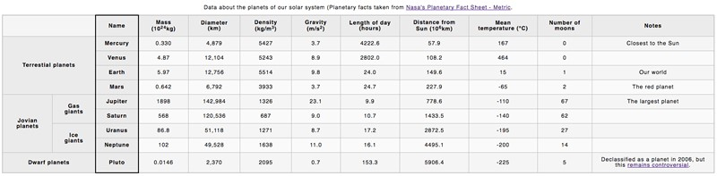

# Examen 4 HTML Ruben Lechosa Cervantes

## Descripción
Hay que hacer el examen siguiendo las instrucciones de la base que ha pasado el professor
Debe quedar como en la siguiente imagen:

## ¿Que necesitamos?

1. Visual Studio Code
2. Base del examen <a href="https://github.com/Rulexloko13/Examen-4-HTML/tree/main/Base%20Examen">Descargar</a>
